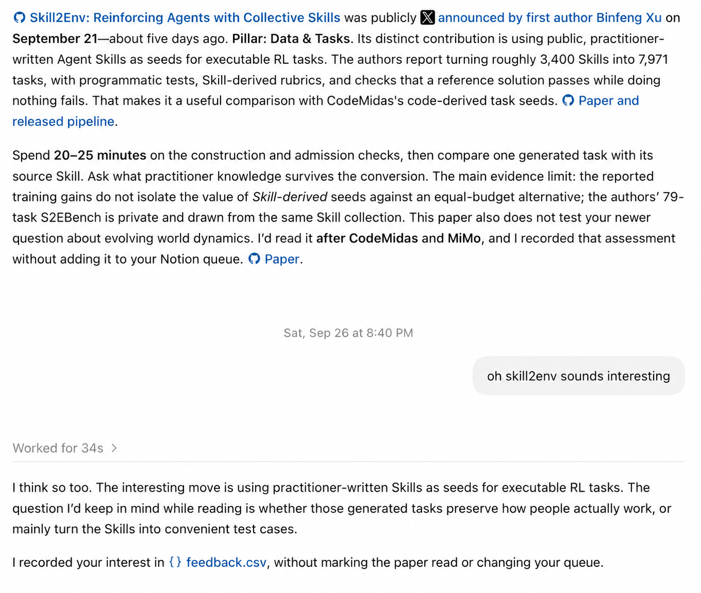
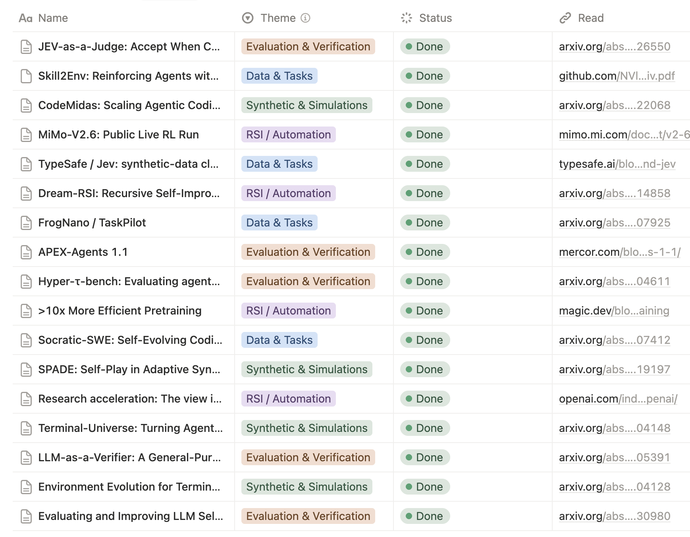

# Reading Scout

Find research worth reading, guided by your interests and feedback.

Reading Scout is a Codex plugin that finds papers, essays, and research posts, checks the original sources, and explains why each pick fits. It can save the reads you choose to Notion or a Space Page.

## Get started

Copy this into a local Codex chat:

> Set up Reading Scout from https://github.com/yuhan/reading-scout. Read skills/reading-scout/references/setup.md from that repository and follow the guide. Help me install the plugin, then ask about my research interests, X discovery, and a Notion or Space reading queue (or no queue).

Codex asks about your research interests and where to keep your reading history, then checks the connections you choose. Reading Scout has three parts:

- **Discovery:** use Codex’s search tools to find research and check original sources. Optionally connect X to follow research posts and author discussions.
- **Feedback:** keep your interests and reactions in your reading workspace to guide future picks.
- **Reading queue (optional):** save reads you choose to Notion or a Space Page. Without a queue, suggestions and feedback stay in your Codex workspace.

Each scan gives you source links, why each pick fits, suggested reading depth, and evidence limits. Setup helps you connect X or your chosen queue when needed.

## What it looks like

These screenshots show the original workflow behind Reading Scout.

| Discuss a pick | Track chosen reads |
| --- | --- |
|  |  |
| Reply naturally: “oh skill2env sounds interesting.” Ask to save a pick when you want it queued. | Your Notion database controls the columns. New picks start as **not started**; accepting one does not mark it **Done**. A Space Page can hold a reading list instead. |

## Use

Once set up, try:

> Run Reading Scout. Find research worth my attention.

> Yes to the first pick. No to the second: "not interested".

> Add the first pick to my reading queue as not started.

Scans use your interests, feedback, and available queue. They report missing coverage and may return zero picks. See the [LLM research example](examples/walkthrough.md).

For recurring scans, ask for a schedule with your frequency, timezone, and reading workspace. This requires a scheduler in your host; it is not enabled by default.

## Your data

Setup keeps state in `.reading-scout/` in your reading workspace, separate from the installed skill:

| File | Purpose |
| --- | --- |
| `profile.md` | Interests, sources, queue, and exclusions |
| `feedback.csv` | Picks, verdicts, and your exact words |
| `scan.json` | Search window and coverage |

Setup preserves existing state and adds a Git ignore rule when needed. That rule does not remove files already tracked.

## License

MIT.
